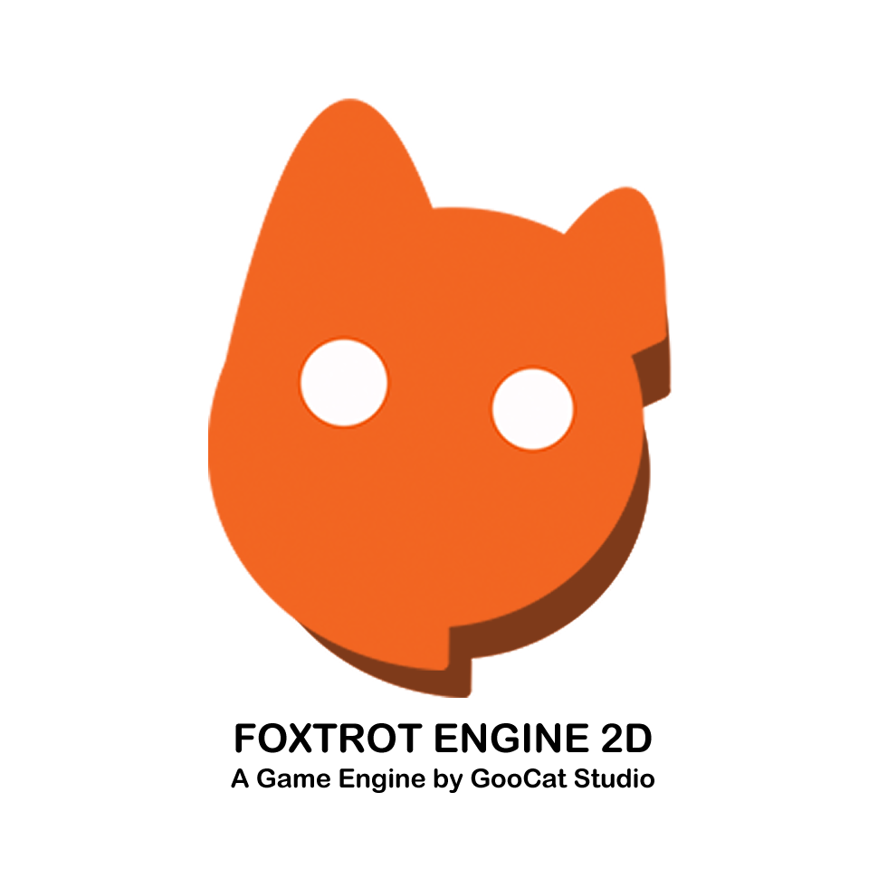

# Foxtrot Engine 2D 

Foxtrot is a 2D game engine based on DirectX 11 for Windows.
It includes Foxtrot Editor which allows users to create & modify scene data, and Foxtrot Engine which executes the produced game based on those data. Scene data are stored as a ".chunk" file, which is a file structure that describes the game data and the required resources.

Foxtrot Engine has been developed by JungBae Park from GooCat Studio for the game in development, SPARED.

## List of Features
- Component based structure that allows to create custom Actors 

- Various Components to create behaviors for Actors 
&nbsp; - Sprite renderer  
&nbsp; - Tilemap renderer with .csv input  
&nbsp; - Sprite animation 
&nbsp; - Rigidbody simulation based on [box2D](https://box2d.org/)  
&nbsp; - 2D colliders in basic shapes (e.g. box collider)  
&nbsp; - User input Management & Moving characters 
&nbsp; - etc. 

- User defined Components can be added as "Behavior"s 

- Create & Modify pre-defined Actors, "Premade"   (similar concept with Unity Engine's "Prefab") 

## Getting Started
### 0. Development environment
Visual Studio 2022 is recommended since the project is not built and tested on other development environments.
### 1. Downloading the repository
Simply clone the repository or download as a .zip file.
### 2. Check for project configuration

Windows SDK Version : 10.0  
Platform Toolset : Visual Studio 2022 (v143)  
C++ Language Standard : ISO C++17 Standard (/std:c++17)  
Vcpkg is enabled, using Manifest. Check out the vcpkg file for package info.

### 3. Use the correct solution configuration
Use **Foxtrot_Debug** when building a game in production.  
**Foxtrot_Editor_Debug** is used for updating Foxtrot Editor so unless you are working on improving the Editor, it is not necessary.

## User Manual
This section will be updated.

## Plans and Goals
Foxtrot Engine has been developed not only as a portfolio to get employed in the game industry but also as a tool of education to obtain game development experiences. The developer also expects to develop this project until it reaches the point of being able to produce a finished 2D game title. Here is the list of upcoming features and goals.

- Artificial intelligence for characters (current WIP) 
- Spine animation renderer  
- Particle system 
- UI testing (this was implemented, but not tested) 
- Establishment of the workflow of Foxtrot Engine -> The development routine  
- Finishing the prototype version of the game, SPARED.